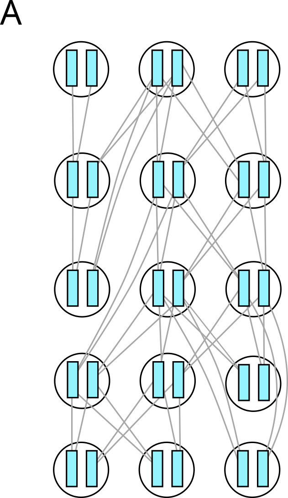
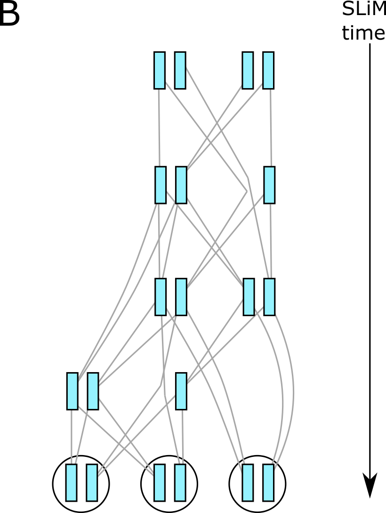

.. _sec_introduction:

============
Introduction
============

This is the documentation for pyslim, a Python API
for reading and modifying `tskit <https://tskit.readthedocs.io/>`_ tree sequence files
produced by `SLiM <https://messerlab.org/slim/>`_, 
or modifying files produced by other programs (e.g.,
`msprime <https://msprime.readthedocs.io/en/stable/>`_,
`fwdpy11
<https://fwdpy11.readthedocs.io/en/stable/pages/tsoverview.html>`_
and `tsinfer <https://tsinfer.readthedocs.io/>`_) for use in SLiM. 

SLiM can read and write *tree sequences*, which store genealogical data of entire populations.
These can be used to efficiently store both the state of the population at various points
during a simulation *as well as* its genealogical history. Furthermore, SLiM can "load" a saved tree sequence
file to recreate the exact state of the population at the time it was saved.
To do this, SLiM has added several additional types of information to the basic tree sequence file
(in "metadata"); this package makes it easy to read and write this information.

********
Overview
********

A tree sequence is a way of storing both genealogies and genotypes
of a bunch of genomes.
See `the tskit documentation <https://tskit.readthedocs.io/en/latest/>`_
for more description of the tree sequence and underlying data structure,
and definitions of the important terms.
Each (haploid) genome is associated with a *node*,
and the "focal" nodes are called *samples*.
Many operations act by default on the samples;
and the tree sequence always describes the history of the entire genome
of each sample, at at least over the time period described by the tree sequence.
(Other nodes in the tree sequence represent ancestral chromosomes
about which we might have only partial information).
SLiM simulates diploid organisms, so each *individual* has two nodes;
many operations you might want to do involve first finding the individuals you want,
and then looking at their nodes.

*******************************************
What does SLiM record in the tree sequence?
*******************************************

Suppose we've run a very small simulation with SLiM.
The genealogical relationships between the various diploid individuals
who were alive over the course of the simulation might look something like
the picture on the left below.
Note that individuals are diploid (each has two chromosomes, or *nodes*),
and that genealogical relationships are between the *nodes*, not the individuals.
However, after we're done we are mainly interested in the genealogies
of the *final* generation, and so as SLiM goes along it
*simplifies* the tree sequence,
retaining only information necessary to describe the genealogies
of certain individuals (exactly which individuals is discussed in the next section).
At the end, we get a tree sequence that looks something like
the situation on the right,
in which many of the nodes and individuals have been removed.

****************************
Who is in the tree sequence?
****************************

OK, but who *is* left in the tree sequence?
We clearly want all individuals of the *final* generation
to have their genealogies recorded in the tree sequence.
But, in the picture above there were individuals pictured
in the tree sequence that were not alive at the end of the simulation.
Who are they?
Which individuals *are* present in a SLiM-produced tree sequence?
**This is an important thing to understand:
the tree sequence contains more individuals than only the final generation.**
There are *three* ways an individual might be in the tree sequence.

.. figure:: _static/pedigree2.png
   :scale: 30%
   :align: right

1. *The final population:*
   Everyone who was alive at the end of the simulation.
   Their nodes are samples.

2. *The remembered individuals:* 
   Everyone who you asked SLiM to *remember*,
   using the ``treeSeqRememberIndividuals()`` method.
   Their nodes are also samples.

3. *The initial population:*
   Everyone who was alive at the *start* of the simulation,
   *whether or not they are ancestral to the final population*.
   Their nodes are *not* samples.

This last category is a common source of confusion:
why are these individuals there?
This is to allow *recapitation*, described in the :ref:`sec_tutorial`:
we need the first generation to be able to trace ancestry back from.
The easiest way to pull out individuals alive at a particular time
is with the :meth:`.SlimTreeSequence.individuals_alive_at()` method.
See :ref:`sec_extracting_individuals` for more discussion.
You can also tell which individuals are in which categories
by looking at their *flags*;
these three categories are marked with the :data:``.INDIVIDUAL_ALIVE``,
:data:``.INDIVIDUAL_REMEMBERED``, and :data:``.INDIVIDUAL_FIRST_GEN`` flags, respectively.
See examples below or in the Vignette for how to do these things.

Here's a reminder of the terminology:

.. figure:: _static/pedigree3.png
   :scale: 40%
   :align: left

************************************************
What else can I find out from the tree sequence?
************************************************

Enough information is stored in the tree sequence
to completely reconstruct the state of the SLiM simulation
(except for user-defined data, like a `tag`).
Most of this is stored as *metadata*, which pyslim makes accessible:
see :ref:`sec_metadata`.

