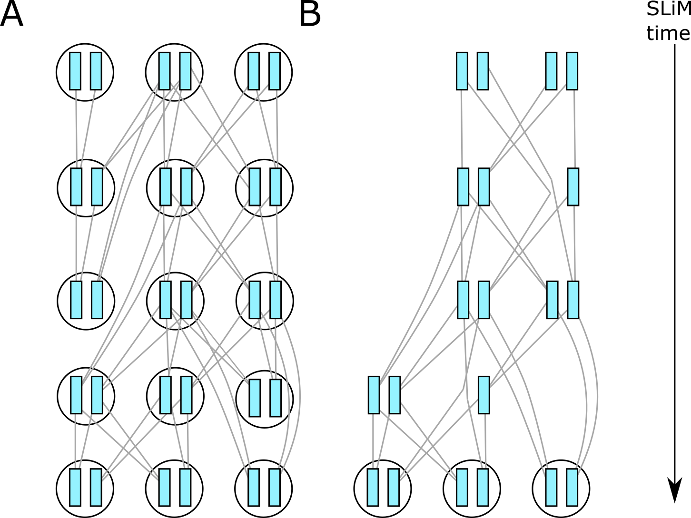
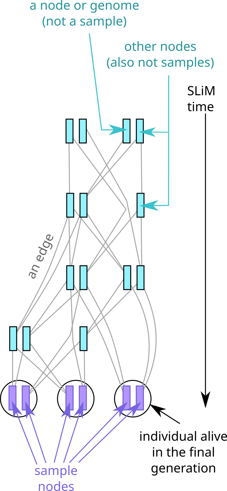

.. _sec_introduction:

============
Introduction
============

This is the documentation for pyslim, a Python API
for reading and modifying `tskit <https://tskit.readthedocs.io/>`_ tree sequence files
produced by `SLiM <https://messerlab.org/slim/>`_, 
or modifying files produced by other programs (e.g.,
`msprime <https://msprime.readthedocs.io/en/stable/>`_,
`fwdpy11
<https://fwdpy11.readthedocs.io/en/stable/pages/tsoverview.html>`_
and `tsinfer <https://tsinfer.readthedocs.io/>`_) for use in SLiM. 

SLiM can read and write *tree sequences*, which store genetic genealogies
for entire populations. These can be used to efficiently encode both the state of the
population at various points during a simulation *as well as* the complete genomic
ancestry. Furthermore, SLiM can "load" a saved tree sequence
file to recreate the exact state of the population at the time it was saved.
To do this, SLiM has added several additional types of information to the basic
tree sequence file.

********
Overview
********

A tree sequence is a way of storing both the full genetic history and the genotypes
of a bunch of genomes.
See `the tskit documentation <https://tskit.readthedocs.io/en/latest/>`_
for more description of the tree sequence and underlying data structure,
and definitions of the important terms.
Each (haploid) genome is associated with a *node*,
and the "focal" nodes are called *sample nodes* or simply *samples*.
Many operations on tree sequences act on the sample nodes by default (see the
`tskit data model <https://tskit.readthedocs.io/en/latest/data-model.html#nodes-genomes-or-individuals>`_
for more on this topic), and the tree sequence always describes the genealogy of the
entire genome of all the samples, at at least over the simulated time period.
(Other nodes in the tree sequence represent ancestral genomes
about which we might have only partial information).
SLiM simulates diploid organisms, so each *individual* usually has two nodes;
many operations you might want to do involve first finding the individuals you want,
and then looking at their nodes.

*******************************************
What does SLiM record in the tree sequence?
*******************************************

Suppose we've run a very small simulation with SLiM. The genetic relationships between
the various diploid individuals who were alive over the course of the simulation might
look something like the picture on the left below. Note that individuals (circles) are
diploid, so that each contains two chromosomes or *nodes* (shaded rectangles),
and that relationships are between the *nodes*, not the individuals.

At the end of the simulation we are typically only interested in the genetic
relationships between the nodes in those individuals which are still alive;
other parts of the genealogy are irrelevant. To save having to store this unnecessary
genealogical information, SLiM *simplifies* the tree sequence as it goes along, retaining
only certain parts of the genetic genealogy. When the tree sequence is output, the result
then looks something like the situation on the right, in which many of the nodes and
individuals have been removed.

.. _sec_left_in_tree_sequence:

*************************************
Who and what is in the tree sequence?
*************************************

OK, who and what exactly *is* left in the tree sequence after the unnecessary
information has been removed? Here's the diagram above with some added terminology.

In the recorded tree sequence the alive individuals, which in this model are those
in the final generation, have all had their nodes marked as *samples*. As
you may recall, this means we have their full genetic ancestry. The sample nodes,
and the individuals containing them, are always present in the tree sequence.

In contrast to the individuals containing sample nodes, you can see that all the other
circles, representing historical (i.e. dead) individuals, have vanished, although
sometimes their nodes remain. By default, only individuals with sample nodes are recorded
in the tree sequence; that means the other, remaining, nodes lose any information about
which individuals they were in (the tutorial explains ways to
:ref:`retain this information <sec_retaining_individuals>`).

As well as the historical individuals, many historical *nodes*  have been removed too,
along with with their genealogical relationships (i.e. the lines, which in
tree-sequence-speak are known as "edges"). The deleted nodes are simply those that are
not needed to reconstruct the relationships between the sample nodes. For example, we
remove nodes leading to a dead end (e.g. in individuals who had no offspring). Similarly,
as time goes on, recombination events in conjunction with genetic drift can gradually
reduce the genetic contribution of parts of older genomes to the current generation.
The generated tree sequence therefore need not contain historical nodes whose genetic
contribution to the samples has been whittled down to zero. Finally, to
reconstruct relationships between samples, strictly we only need to keep a node if it
represents the genetic *most recent common ancestor* (MRCA) of at least two samples. So
by default, we also remove historical nodes that are only "on the line to" a sample, but
do not represent a branching point (i.e. coalescent event) on the tree.

************************************************
What else can I find out from the tree sequence?
************************************************

Enough information is stored in the tree sequence
to completely reconstruct the state of the SLiM simulation
(except for user-defined data, like a `tag`).
Most of this is stored as *metadata*, which pyslim makes accessible:
see :ref:`sec_metadata`.

