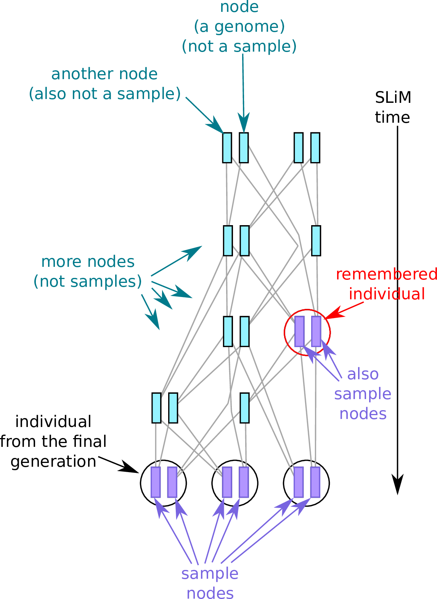

.. _sec_introduction:

============
Introduction
============

This is the documentation for pyslim, a Python API
for reading and modifying `tskit <https://tskit.readthedocs.io/>`_ tree sequence files
produced by `SLiM <https://messerlab.org/slim/>`_, 
or modifying files produced by other programs (e.g.,
`msprime <https://msprime.readthedocs.io/en/stable/>`_,
`fwdpy11
<https://fwdpy11.readthedocs.io/en/stable/pages/tsoverview.html>`_
and `tsinfer <https://tsinfer.readthedocs.io/>`_) for use in SLiM. 

SLiM can read and write *tree sequences*, which store genealogical data of entire populations.
These can be used to efficiently store both the state of the population at various points
during a simulation *as well as* its genealogical history. Furthermore, SLiM can "load" a saved tree sequence
file to recreate the exact state of the population at the time it was saved.
To do this, SLiM has added several additional types of information to the basic tree sequence file.

********
Overview
********

A tree sequence is a way of storing both genealogies and genotypes
of a bunch of genomes.
See `the tskit documentation <https://tskit.readthedocs.io/en/latest/>`_
for more description of the tree sequence and underlying data structure,
and definitions of the important terms.
Each (haploid) genome is associated with a *node*,
and the "focal" nodes are called *samples*.
Many operations act by default on the samples;
and the tree sequence always describes the history of the entire genome
of each sample, at at least over the time period described by the tree sequence.
(Other nodes in the tree sequence represent ancestral chromosomes
about which we might have only partial information).
SLiM simulates diploid organisms, so each *individual* has two nodes;
many operations you might want to do involve first finding the individuals you want,
and then looking at their nodes.

*******************************************
What does SLiM record in the tree sequence?
*******************************************

Suppose we've run a very small simulation with SLiM.
The genealogical relationships between the various diploid individuals
who were alive over the course of the simulation might look something like
the picture on the left below.
Note that individuals are diploid (each has two chromosomes, or *nodes*),
and that genealogical relationships are between the *nodes*, not the individuals.
However, after we're done we are mainly interested in the genealogies
of the *final* generation, and so as SLiM goes along, it *simplifies* the tree sequence,
retaining only information necessary to describe the genealogies
of certain individuals (the current generation and any that have been *Remembered* along the way).
At the end, we get a tree sequence that looks something like
the situation on the right,
in which many of the nodes and individuals have been removed.

.. figure:: _static/pedigree01.png
   :scale: 40%

*************************************
Who and what is in the tree sequence?
*************************************

OK, who and what exactly *is* left in the tree sequence?
We clearly want all individuals of the *final* generation
to have their genealogies recorded in the tree sequence.
in the picture above there is one additional individuals pictured
in the tree sequence that was not alive at the end of the simulation,
because it was *remembered*, using the ``treeSeqRememberIndividuals()`` method.

.. figure:: _static/pedigree2.png
   :scale: 40%

The nodes (i.e., the chromosomes) of these individuals
are the *samples* of the tree sequence.
Saying that a chromosome is a *sample* implies that we have full information about
its genealogy, and many operations on tree sequences act on the samples
by default.
See the `tskit data model <https://tskit.readthedocs.io/en/latest/data-model.html#nodes-genomes-or-individuals>`_ for more on this topic.
The easiest way to pull out individuals alive at a particular time
is with the :meth:`.SlimTreeSequence.individuals_alive_at()` method:
see :ref:`sec_extracting_individuals` for more discussion.

Here's a reminder of the terminology:

.. note::

   In previous versions of SLiM/pyslim, the *first generation* of individuals
   were retained in the tree sequence, to allow recapitation.
   This is no longer necessary, so these are *no longer present*, unless
   you specifically Remember them -- see the :ref:`sec_tutorial_recapitation`
   section of the tutorial for more discussion of how this works.

************************************************
What else can I find out from the tree sequence?
************************************************

Enough information is stored in the tree sequence
to completely reconstruct the state of the SLiM simulation
(except for user-defined data, like a `tag`).
Most of this is stored as *metadata*, which pyslim makes accessible:
see :ref:`sec_metadata`.

