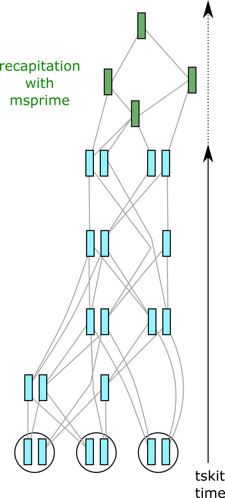
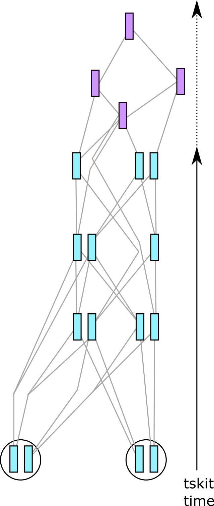
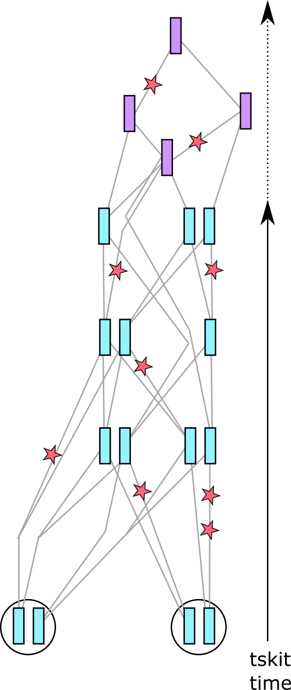
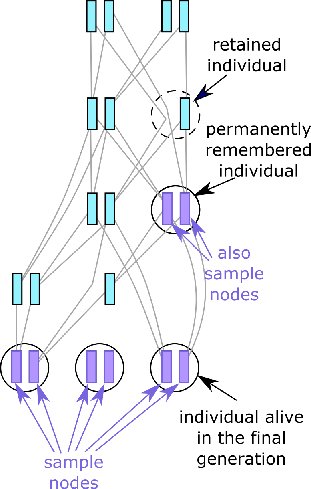

.. _sec_tutorial:

========
Tutorial
========

There are several very common uses of tree sequences in SLiM/pyslim. These are covered
in this tutorial.

******************************************
Recapitation, simplification, and mutation
******************************************

Perhaps the most common pyslim operations involve :ref:`sec_tutorial_recapitation`,
:ref:`sec_tutorial_simplification`,  and/or :ref:`sec_tutorial_adding_neutral_mutations`.
Below we illustrate all three in the context of running a "hybrid" simulation, combining
both forwards and backwards (coalescent) methods. This hybrid approach is a popular
application of pyslim because coalescent algorithms, although more limited in the degree
of biological realism they can attain, can be much faster than the forwards algorithms
implemented in SLiM.

A typical use-case is to take an existing SLiM simulation and endow
it with a history derived from a coalescent simulation: this is known as *recapitation*.
For instance, suppose we have a SLiM simulation of a population of 100,000 individuals
that we have run for 10,000 generations without neutral mutations. Now, we wish to
extract whole-genome genotype data for only 1,000 individuals. Here's one way to do it:

1. :meth:`.SlimTreeSequence.recapitate` :
   The simulation has likely not reached demographic equilibrium - it has not
   *coalesced* entirely; recapitation uses coalescent simulation to provide
   a "prior history" for the initial generation of the simulation.

2. :meth:`.SlimTreeSequence.simplify` : For efficiency, subset the tree
   sequence to only the information relevant for those 1,000 individuals
   we wish to sample.
   **Important: this should probably come *after* recapitation (see below).**

3. :meth:`msprime.mutate` : Adds neutral mutations to the tree sequence.

These steps are described below. First, to get something to work with,
you can run this simple SLiM script of a single population of sexual organisms,
fluctuating around 1000 individuals, for 1000 generations:

.. literalinclude:: example_sim.slim

(Note: by setting the random seed in the simulation,
you should get exactly the same results as the code below.)

.. _sec_tutorial_recapitation:

++++++++++++
Recapitation
++++++++++++

Although we can initialize a SLiM simulation with the results of a coalescent simulation,
if during the simulation we don't actually use the genotypes for anything, it
can be much more efficient to do this afterwards, hence only doing a coalescent
simulation for the portions of the first-generation ancestors that have
not yet coalesced. (See the SLiM manual for more explanation.)
This is depicted in the figure at the right:
imagine that at some sites, some of the samples
don't share a common ancestor within the SLiMulated portion of history (shown in blue).
Recapitation starts at the *top* of the genealogies,
and runs a coalescent simulation back through time
to fill out the rest of genealogical history relevant to the samples.
The purple chromosomes are new ancestral nodes that have been added to the tree sequence.
This is important - if we did not do this,
then effectively we are assuming the initial population would be genetically homogeneous,
and so our simulation would have less genetic variation than it should have
(since the component of variation from the initial population would be omitted).

Doing this is as simple as:

.. code-block:: python

   orig_ts = pyslim.load("example_sim.trees")
   rts = orig_ts.recapitate(recombination_rate = 1e-8, Ne=200, random_seed=5)

We can check that this worked as expected, by verifying that after recapitation
all trees have only one root:

.. code-block:: python

   orig_max_roots = max(t.num_roots for t in orig_ts.trees())
   recap_max_roots = max(t.num_roots for t in rts.trees())
   print(f"Before recapitation, the max number of roots was {orig_max_roots}, "
         f"and after recapitation, it was {recap_max_roots}.")
   # Before recapitation, the max number of roots was 15, and after recapitation, it was 1.

Note that demography needs to be set up explicitly - if you have more than one population,
you must set migration rates or else coalescence will never happen
(see below for an example, and :meth:`.SlimTreeSequence.recapitate` for more).

Recapitation with a nonuniform recombination map
------------------------------------------------

Above, we recapitated using a uniform genetic map.
But, msprime - like SLiM - can simulate with recombination drawn from an arbitrary genetic map.
Let's say we've already got a recombination map as specified by SLiM,
as a vector of "positions" and a vector of "rates".
msprime also needs vectors of positions and rates, but the format is slightly different.
To use the SLiM values for msprime, we need to do three things:

1. Add a 0 at the beginning of the positions,
2. add a 0 at the end of the rates, and
3. add 1 to the final value in "positions".

The reason why msprime "positions" must start with 0 (step 1) is that in SLiM,
a position or "end" indicates the end of a recombination block such that its associated
"rate" applies to everything to the left of that end (see ``initializeRecombinationRate``).
In msprime, `the manual <https://msprime.readthedocs.io/en/stable/api.html#variable-recombination-rates>`_ says:

    Given an index j in these lists, the rate of recombination per base per
    generation is rates[j] over the interval positions[j] to positions[j + 1].
    Consequently, the first position must be zero, and by convention the last
    rate value is also required to be zero (although it is not used).

This means that positions for msprime are both starts and ends.
As a consequence, msprime needs a vector of positions that is 1 longer than what you give SLiM,
and msprime also needs 1 fewer rates than it has positions,
but you just add the 0.0 on at the end of the rates vector "by convention" (step 2).

The reason for step 3 is that intervals for tskit (which msprime uses)
are "closed on the left and open on the right",
which means that the genomic interval from 0.0 to 100.0 includes 0.0 but does not include 100.0.
If SLiM has a final genomic position of 99, then it could have mutations occurring at position 99.
Such mutations would *not* be legal, on the other hand, if we set the tskit sequence length to 99,
since the position 99 would be outside of the interval from 0 to 99.
So, in SLiM when we record tree sequences, we use the last position plus one
- i.e., the length of the genome - as the rightmost coordinate.

For instance, suppose that we have a recombination map file in the following (tab-separated) format:

.. literalinclude:: _static/recomb_rates.tsv

This describes recombination rates across a 1Mb segment of genome
with higher rates on the ends
(for instance, 3.2 and 2.8 cM/Mb in the first and last 150Kb respectively)
and lower rates in the middle (0.25 cM/Mb between 500Kb and 850Kb).
The first column gives the starting position, in bp,
for the window whose recombination rate is given in the second column.
(*Note:* this is *not* a standard format for recombination maps
- it is more usual for the *starting*
position to be listed!)

Here is SLiM code to read this file and set the recombination rates:

.. code-block::

   lines = readFile("recomb_rates.tsv");
   header = strsplit(lines[0], "\t");
   if (header[0] != "end_position"
       | header[1] != "rate(cM/Mb)") {
       stop("Unexpected format!");
   }
   rates = NULL;
   ends = NULL;
   nwindows = length(lines) - 1;
   for (line in lines[1:nwindows]) {
      components = strsplit(line, "\t");
      ends = c(ends, asInteger(components[0]));
      rates = c(rates, asFloat(components[1]));
   }
   initializeRecombinationRate(rates * 1e-8, ends);

Now, here's code to take the same recombination map used in SLiM,
and use it for recapitation in msprime:

.. code-block:: python

   import msprime, pyslim
   import numpy as np
   ts = pyslim.load("sim.trees")
   positions = []
   rates = []
   with open('recomb_rates.tsv', 'r') as file:
      header = file.readline().strip().split("\t")
      assert(header[0] == "end_position" and header[1] == "rate(cM/Mb)")
      for line in file:
         components = line.split("\t")
         positions.append(float(components[0]))
         rates.append(1e-8 * float(components[1]))

   # step 1   
   positions.insert(0, 0) 
   # step 2
   rates.append(0.0)
   # step 3
   positions[-1] += 1

   recomb_map = msprime.RecombinationMap(positions, rates)
   rts = ts.recapitate(recombination_map=recomb_map, Ne=1000)
   assert(max([t.num_roots for t in rts.trees()]) == 1)

Next, one might wish to sanity check the result,
for instance, by setting rates in one interval to zero
and making sure that no recombinations occurred in that region.

.. note::

   Starting from msprime 1.0, there will be a ``discrete`` argument to
   the RecombinationMap class; setting ``discrete=True`` will more closely
   match the recombination model of SLiM.

.. _sec_tutorial_simplification:

++++++++++++++
Simplification
++++++++++++++

Probably, your simulations have produced many more fictitious genomes
than you will be lucky enough to have in real life,
so at some point you may want to reduce your dataset to a realistic sample size.
We can get rid of unneeded samples and any extra information from them by using
an operation called *simplification* (this is the same basic approach that SLiM
implements under the hood when outputting a tree sequence, as described in
:ref:`the introduction <sec_left_in_tree_sequence>`).

Depicted in the figure at the right is the result of applying an explicit call to
``simplify()`` to our example tree sequence. In the call we asked to keep only 4
genomes (contained in 2 of the individuals in the current generation). This has
substantially simplified the tree sequence, because only information relevant to the
genealogies of the 4 sample nodes has been kept. (Precisely, simplification retains only
nodes of the tree sequence that are branching points of some marginal genealogy -- see
`Kelleher et al 2018 <https://doi.org/10.1371/journal.pcbi.1006581>`_ for details.)
While simplification sounds very appealing - it makes things simpler after all -
it is often not necessary in practice, because tree sequences are very compact,
and many operations with them are quite fast.
(It will, however, speed up many operations, so if you plan to do a large number of simulations,
your workflow could benefit from early simplification.)
So, you should probably not make simplification a standard step in your workflow,
only using it if necessary.

It is important that simplification - if it happens at all -
either (a) comes after recapitation, or (b) is done with the
``keep_input_roots=True`` option (see :meth:`tskit.TreeSequence.simplify`).
This is because simplification removes some of the
ancestral genomes in the first generation,
which are necessary for recapitation,
unless it is asked to "keep the input roots".
If we simplify without this option before recapitating,
some of the first-generation blue chromosomes in the figure on the right
would not be present, so the coalescent simulation would start from a more recent point in time
than it really should.
As an extreme example, suppose our SLiM simulation has a single diploid who has reproduced
by clonal reproduction for 1,000 generations,
so that the final tree sequence is just two vertical lines of descent going back
to the two chromosomes in the initial individual alive 1,000 generations ago.
Recapitation would produce a shared history for these two chromosomes,
that would coalesce some time longer ago than 1,000 generations.
However, if we simplified first, then those two branches going back 1,000 generations would be removed,
since they don't convey any information about the shape of the tree;
and so recapitation could well produce a common ancestor more recently than 1,000 generations,
which is inconsistent with the SLiM simulation.

After recapitation,
simplification to the history of 100 individuals alive today
can be done with the :meth:`.SlimTreeSequence.simplify` method:

.. code-block:: python

   import numpy as np
   np.random.seed(3)
   alive_inds = rts.individuals_alive_at(0)
   keep_indivs = np.random.choice(alive_inds, 100, replace=False)
   keep_nodes = []
   for i in keep_indivs:
      keep_nodes.extend(rts.individual(i).nodes)
   sts = rts.simplify(keep_nodes)

   print(f"Before, there were {rts.num_samples} sample nodes (and {rts.num_individuals} individuals) "
          f"in the tree sequence, and now there are {sts.num_samples} sample nodes "
          f"(and {sts.num_individuals} individuals).")
   # Before, there were 1930 sample nodes (and 965 individuals) in the tree sequence,
   # and now there are 200 sample nodes (and 115 individuals).

**Note** that you must pass simplify a list of *node IDs*, not individual IDs.
Here, we used the :meth:`.SlimTreeSequence.individuals_alive_at` method to obtain the list
of individuals alive today.
Also note that there are *still* more than 100 individuals remaining - 15 non-sample individuals
have not been simplified away,
because they have nodes that are required to describe the genealogies of the samples.
(Since this is a non-Wright-Fisher simulation,
parents and children can be both alive at the same time in the final generation.)

.. _sec_tutorial_adding_neutral_mutations:

+++++++++++++++++++++++++++++++++++++++++++++
Adding neutral mutations to a SLiM simulation
+++++++++++++++++++++++++++++++++++++++++++++

If you have recorded a tree sequence in SLiM, likely you have not included any neutral mutations,
since it is much more efficient to simply add these on afterwards.
To add these (in a completely equivalent way to having included them during the simulation),
you can use the :meth:`msprime.mutate` function, which returns a new tree sequence with additional mutations.
Continuing with the cartoons from above, these are added to each branch of the tree sequence
at the rate per unit time that you request.
This works as follows:

.. code-block:: python

   ts = pyslim.SlimTreeSequence(msprime.mutate(sts, rate=1e-8, keep=True))

   print(f"The tree sequence now has {ts.num_mutations} mutations, "
         f"and mean pairwise nucleotide diversity is {ts.diversity()}.")
   # The tree sequence now has 28430 mutations, and mean pairwise nucleotide diversity is 2.3319e-05.

This adds infinite-sites mutations at a rate of 1e-8 per site, making sure to
``keep`` any existing mutations.
We have wrapped the call to :meth:`msprime.mutate` in a call to
:class:`pyslim.SlimTreeSequence`, because :meth:`msprime.mutate` returns an *msprime* tree sequence,
and by converting it back into a ``pyslim`` tree sequence we can still use the methods
defined by ``pyslim``. (The conversion does not modify the tree sequence at all,
it only adds the ``.slim_generation`` attribute.) The output of other ``msprime``
functions that return tree sequences may be converted back to
:class:`pyslim.SlimTreeSequence` in the same way.

********************************
Obtaining and saving individuals
********************************

.. _sec_extracting_individuals:

++++++++++++++++++++++++++++++++++++++
Extracting particular SLiM individuals
++++++++++++++++++++++++++++++++++++++

To get another example with discrete subpopulations,
let's run another SLiM simulation, similar to the above
but with two populations exchanging migrants:

.. literalinclude:: migrants.slim

The first, most common method to extract individuals is simply to
get all those that were alive at a particular time, using
:meth:`.SlimTreeSequence.individuals_alive_at()`.
For instance, to get the list of individual IDs of
all those alive at the end of the simulation
(i.e., zero time units ago), we could do:

.. code-block:: python

   orig_ts = pyslim.load("migrants.trees")
   alive = orig_ts.individuals_alive_at(0)
   
   print(f"There are {len(alive)} individuals alive from the final generation.")
   # There are 2020 individuals alive from the final generation.

These are individual IDs, and we can use ``ts.individual( )`` to get information
about each of these individuals from their ID.
For instance,
to then count up how many of these individuals are in each population,
we could do:

.. code-block:: python

   num_alive = [0 for _ in range(orig_ts.num_populations)]
   for i in alive:
      ind = orig_ts.individual(i)
      num_alive[ind.population] += 1

   for pop, num in enumerate(num_alive):
      print(f"Number of individuals in population {pop}: {num}")

   # Number of individuals in population 0: 0
   # Number of individuals in population 1: 984
   # Number of individuals in population 2: 1036

Our SLiM script started numbering populations at 1, while tskit starts counting at 0,
so there is an empty "population 0" in a SLiM-produced tree sequence.

Now, let's recapitate and mutate the tree sequence.
Recapitation takes a bit more thought, because we have to specify a migration matrix
(or else it will run forever, unable to coalesce).

.. code-block:: python

   pop_configs = [msprime.PopulationConfiguration(initial_size=1000)
                  for _ in range(orig_ts.num_populations)]
   rts = orig_ts.recapitate(population_configurations=pop_configs,
                            migration_matrix=[[0.0, 0.0, 0.0],
                                              [0.0, 0.0, 0.1],
                                              [0.0, 0.1, 0.0]],
                            recombination_rate=1e-8,
                            random_seed=4)
   ts = pyslim.SlimTreeSequence(
            msprime.mutate(rts, rate=1e-8, random_seed=7))

Again, there are *three* populations because SLiM starts counting at 1;
the first population is unused (no migrants can go to it).
Let's compute genetic diversity within and between each of the two populations
(we compute the mean density of pairwise nucleotide differences,
often denoted :math:`\pi` and :math:`d_{xy}`).
To do this, we need to extract the node IDs from the individuals of the two populations
that are alive at the end of the simulation.

.. code-block:: python

   pop_indivs = [[], [], []]
   pop_nodes = [[], [], []]
   for i in ts.individuals_alive_at(0):
      ind = ts.individual(i)
      pop_indivs[ind.population].append(i)
      pop_nodes[ind.population].extend(ind.nodes)

   diversity = ts.diversity(pop_nodes[1:])
   divergence = ts.divergence(pop_nodes[1:], indexes=[(0,1)])

   print(f"There are {ts.num_mutations} mutations across {ts.num_trees} distinct "
         f"genealogical trees describing relationships among {ts.num_samples} "
         f"sampled genomes, with a mean genetic diversity of {diversity[0]} and "
         f"{diversity[1]} within the two populations, and a mean divergence of "
         f"{divergence[0]} between them.")
   # There are 115500 mutations across 50613 distinct genealogical trees describing relationships
   # among 4040 sampled genomes, with a mean genetic diversity of 9.064e-05 and 9.054e-05 within
   # the two populations, and a mean divergence of 9.135839855153494e-05 between them.

+++++++++++++++++++
Individual metadata
+++++++++++++++++++

Each ``Mutation``, ``Population``, ``Node``, and ``Individual``, as well as the tree 
sequence as a whole, carries additional information stored by SLiM in its ``metadata``
property. A fuller description of metadata in general is given in :ref:`sec_metadata`,
but as a quick introduction, here is the information available
about an individual in the previous example:

.. code-block:: python

    print(ts.individual(0))

   # {'id': 0, 'flags': 65536,
   #  'location': array([0., 0., 0.]),
   #  'metadata': {
   #               'pedigree_id': 1003551,
   #               'age': 1,
   #               'subpopulation': 1,
   #               'sex': 0,
   #               'flags': 0
   #              },
   #  'nodes': array([4000, 4001], dtype=int32),
   #  'population': 1,
   #  'time': 16.0}

Some information is generic to individuals in tree sequences of any format:
``id`` (the ID internal to the tree sequence),
``flags`` (described :ref:`below <sec_individual_flags>`),
``location`` (the [x,y,z] coordinates of the individual),
``nodes`` (an array of the node IDs that represent the genomes of this individual),
and ``time`` (the time, in units of "time ago" that the individual was born).

Other information, contained in the ``metadata`` field, is specific to tree sequences
produced by SLiM. This is described in more detail in the SLiM manual, but briefly:

- the  ``pedigree_id`` is SLiM's internal ID for the individual,
- ``age`` and ``subpopulation`` are their age and population at death, or at the time
  the simulation stopped if they were still alive  (NB: SLiM uses the word
  "subpopulation" for what is simply called a "population" in tree-sequence parlance)
- ``sex`` is their sex (as an integer, one of :data:`.INDIVIDUAL_TYPE_FEMALE`,
  :data:`.INDIVIDUAL_TYPE_MALE`, or :data:`.INDIVIDUAL_TYPE_HERMAPHRODITE`),

.. todo::
    Add description of ``metadata["flags"]``: how does this differ from ``individual.flags``?

We can use this metadata in many ways, for example, to create an age distribution by sex:

.. code-block:: python

   import numpy as np
   max_age = max([ind.metadata["age"] for ind in ts.individuals()])
   age_table = np.zeros((max_age + 1, 2))
   age_labels = {pyslim.INDIVIDUAL_TYPE_FEMALE: 'females',
                 pyslim.INDIVIDUAL_TYPE_MALE: 'males'}
   for i in ts.individuals_alive_at(0):
      ind = ts.individual(i)
      age_table[ind.metadata["age"], ind.metadata["sex"]] += 1

   print(f"number\t{age_labels[0]}\t{age_labels[1]}")
   for age, x in enumerate(age_table):
      print(f"{age}\t{x[0]}\t{x[1]}")

   # number  females   males
   # 0        327.0    343.0
   # 1        213.0    226.0
   # 2        165.0    144.0
   # 3         99.0    112.0
   # 4         79.0    68.0
   # 5         48.0    37.0
   # 6         31.0    38.0
   # 7         16.0    13.0
   # 8         10.0     8.0
   # 9          7.0    10.0
   # 10         4.0     3.0
   # 11         3.0     4.0
   # 12         4.0     1.0
   # 13         2.0     1.0
   # 14         1.0     0.0
   # 15         0.0     1.0
   # 16         0.0     0.0
   # 17         1.0     0.0
   # 18         0.0     0.0
   # 19         0.0     0.0
   # 20         0.0     0.0
   # 21         1.0     0.0

We have looked up how to interpret the ``sex`` attribute
by using the values of :data:`.INDIVIDUAL_TYPE_FEMALE` (which is 0)
and :data:`.INDIVIDUAL_TYPE_MALE` (which is 1).
In a simulation without separate sexes,
all individuals would have sex equal to :data:`.INDIVIDUAL_TYPE_HERMAPHRODITE`
(which is -1).

Several fields associated with individuals are also available as numpy arrays,
across all individuals at once:
:attr:`.SlimTreeSequence.individual_locations`,
:attr:`.SlimTreeSequence.individual_populations`,
:attr:`.SlimTreeSequence.individual_ages`,
and :attr:`.SlimTreeSequence.individual_times` (also see
:meth:`.SlimTreeSequence.individual_ages_at`). Using these can sometimes be easier than
iterating over individuals as above. For example,
suppose that we want to randomly sample 10 individuals alive and older than 2 time steps
from each of the populations at the end of the simulation,
and simplify the tree sequence to retain only those individuals.
This can be done using the numpy arrays :attr:`.SlimTreeSequence.individual_ages`
and :attr:`.SlimTreeSequence.individual_populations` as follows:

.. code-block:: python

   alive = ts.individuals_alive_at(0)
   adults = alive[ts.individual_ages[alive] > 2]
   pops = [np.where(
              ts.individual_populations[adults] == k)[0] for k in [1, 2]]
   sample_inds = [np.random.choice(pop, 10, replace=False) for pop in pops]
   sample_nodes = []
   for samp in sample_inds:
      for i in samp:
         sample_nodes.extend(ts.individual(i).nodes)
   sub_ts = ts.simplify(sample_nodes)

The resulting tree sequence does indeed have fewer individuals and fewer trees:

.. code-block:: python

   print(f"There are {sub_ts.num_mutations} mutations across {sub_ts.num_trees} distinct "
         f"genealogical trees describing relationships among {sub_ts.num_samples} "
         f"sampled genomes, with a mean overall genetic diversity of {sub_ts.diversity()}.")
   # There are 44576 mutations across 25154 distinct genealogical trees describing relationships
   # among 40 sampled genomes, with a mean overall genetic diversity of 9.087-05.

++++++++++++++++++++++
Historical individuals
++++++++++++++++++++++

As we've seen, a basic tree sequence output by SLiM only contains the currently alive
individuals and the ancestral nodes (genomes) required to reconstruct their genetic
relationships. But you might want more than that. For example, there may be individuals
who are not alive any more, but whose complete ancestry you would like to know. Or
perhaps you'd like to know how the final generation relates to particular individuals in
the past. Or it may be that you want to access the spatial location of historical genomes
(which, for technical reasons is linked to individuals, not to genomes). The solution is
to *remember* an individual during the simulation, using the SLiM function
``treeSeqRememberIndividuals()``. Individuals can be Remembered in two ways, as
described below.

.. _sec_remembering_individuals:

Permanently remembering individuals
-----------------------------------

By default, a call to ``treeSeqRememberIndividuals()`` will permanently remember one or
more individuals, by marking their nodes as actual samples: the simulated equivalent of
ancient DNA dug out of permafrost, or stored
in an old collecting tube. This means any tree sequence subsequently recorded will always
contain this individual, its nodes (now marked as samples), and its full ancestry. As
with any other sample nodes, any permanently remembered individuals can be removed from
the tree sequence by :ref:`sec_tutorial_simplification`. The result of remembering an
individual in the :ref:`introductory example <sec_left_in_tree_sequence>` is pictured on the right.

.. _sec_retaining_individuals:

Retaining individuals
---------------------

Alternatively, you may want to avoid treating historical individuals and their genomes as
actual samples, but temporarily *retain* them as long as they are still relevant to
reconstructing the genetic ancestry of the sample nodes. This can save some computational
burden, as not only will nodes and individuals be removed once they are no longer
ancestral, but also the full ancestry of the retained individuals does not need to be
kept. You can retain individuals in this way by using
``treeSeqRememberIndividuals(..., permanent=F)``.

Since a retained individual's nodes are not marked as samples, they are subject to the
:ref:`normal removal process <sec_left_in_tree_sequence>`, and it is possible to end up
with an individual containing only one genome, as shown in the diagram. However, as soon
as *both* nodes of a retained individual have been lost, the individual itself is deleted
too.

Note that by default, nodes are only kept if they mark a coalescent point (MRCA or branch
point) in one or more of the trees in a tree sequence. This can be changed by
initialising tree sequence recording in SLiM using 
``treeSeqInitialize(retainCoalescentOnly=F)``. SLiM will then
preserve all retained individuals while they remain in the genealogy, even if their nodes
are not coalescent points in a tree (so-called "unary nodes"). Similarly, if you later
decide to reduce the number of samples via :ref:`sec_tutorial_simplification`,
retained individuals will be kept only if they are still MRCAs in the ancestry of the
selected samples. To preserve them even if their nodes are not coalescent points, you
can specify ``ts.simplify(selected_samples, keep_unary_in_individuals=True)``.

.. todo::
    Add SLiM code which includes retaining and remembering, and perhaps some python code
    to show them.

.. _sec_remembering_everyone:

Remembering everyone
--------------------

Although not needed to reconstruct full genomic history, it is perfectly possible to
apply ``treeSeqRememberIndividuals()`` to every individual in every generation of a
simulation (i.e. everyone who has ever lived). If you simply mark everyone for temporary
retention, it should not increase the memory burden of your simulation much: most
individuals will be removed as the simulation progresses, since they will not contain
coalescent nodes. However, if you use ``treeSeqInitialize(retainCoalescentOnly=F)``,
the number of individuals in the resulting tree sequence is likely to become very large,
and the efficiencies provided by tree sequence recording will be substantially reduced.
Indeed in this case, retaining will be much the same as permanently remembering everyone
who has ever lived. Nevertheless, if you are willing to sacrifice enough computer memory,
either of these is (perhaps surprisingly) possible, even for medium-sized simulations. 

.. _sec_individual_flags:

Individual flags
----------------

We have seen that an individual can appear in the tree sequence because it was
Remembered, Retained, or alive at the end of the simulation (note these
are not mutually exclusive). The ``Individual.flags`` value stores this information.
For example, to count up the different individual types, we could do this:

.. todo::
    Update this code with the simulation above so that we have some remembered and
    retained individuals present

.. code-block:: python

   indiv_types = {"remembered" : 0,
                  "retained" : 0,
                  "alive" : 0}
   for ind in ts.individuals():
      if ind.flags & pyslim.INDIVIDUAL_REMEMBERED:
         indiv_types['remembered'] += 1
      if ind.flags & pyslim.INDIVIDUAL_RETAINED:
         indiv_types['retained'] += 1
      if ind.flags & pyslim.INDIVIDUAL_ALIVE:
         indiv_types['alive'] += 1

   for k in indiv_types:
      print(f"Number of individuals that are {k}: {indiv_types[k]}")

   # Number of individuals that are remembered: 0
   # Number of individuals that are retained: 0
   # Number of individuals that are alive: 2012

.. note::

    In previous versions of SLiM/pyslim, the first generation of individuals were
    kept in the tree sequence, to allow :ref:`sec_tutorial_recapitation`. With the
    addition of the ``keep_input_roots=True`` option to the
    :ref:`sec_tutorial_simplification` process, this is no longer necessary,
    so these are no longer present, unless you specifically Remember them.

******************************
Coalescent simulation for SLiM
******************************

The :func:`.annotate` command helps make this easy, by adding default
information to a tree sequence, allowing it to be read in by SLiM. This will
simulate a tree sequence with msprime, add SLiM information, and write it out
to a ``.trees`` file:

.. code-block:: python

   import msprime
   import pyslim

   # simulate a tree sequence of 12 sample genomes
   ts = msprime.simulate(12, mutation_rate=0.0, recombination_rate=1e-8, length=1e6)
   new_ts = pyslim.annotate_defaults(ts, model_type="nonWF", slim_generation=1)
   new_ts.dump("initialize_nonWF.trees")

Note that we have set the mutation rate to ``0.0``:
this is because any mutations that are produced will be read in by SLiM...
which *could* be a very useful thing, if you want to generate mutations with msprime
that provide standing variation for selection within SLiM...
**but**, the last msprime release only produces mutations
with an infinite-sites model, while SLiM requires mutation positions to be at integer positions.
This will change in msprime v1.0, and is already implemented in the development version,
so if you'd really like to do this, get in touch.
When this is released we plan to write a vignette of how to do it.
*However*, if you intend the pre-existing mutations to be *neutral*,
then there is no need to add them at this point;
you can add them after the fact, as discussed above.
Also note that we have set ``slim_generation`` to 1;
this means that as soon as we load the tree sequence into SLiM,
SLiM will set the current time counter to 1.
(If we set ``slim_generation`` to 100, then any script blocks scheduled to happen before 100
would not execute after loading the tree sequence.)

The resulting file ``slim_ts.trees`` can be read into SLiM to be used as a starting state,
as illustrated in this minimal example::

   initialize()
   {
       initializeSLiMModelType("nonWF");
       initializeTreeSeq();
       initializeMutationRate(1e-2);
       initializeMutationType("m1", 0.5, "f", -0.1);
       initializeGenomicElementType("g1", m1, 1.0);
       initializeGenomicElement(g1, 0, 1e6-1);
       initializeRecombinationRate(1e-8);
   }

   1 early() { 
       sim.readFromPopulationFile("initialize_nonWF.trees");
   }

   10 {
       sim.treeSeqOutput("nonWF_restart.trees");
       catn("Done.");
       sim.simulationFinished();
   }

See the SLiM manual for more about this operation.

***********************************************
Extracting information about selected mutations
***********************************************

Here is a simple SLiM simulation with two types of mutation:
`m1` are deleterious, and `m2` are beneficial.
Let's see how to extract information about these mutations.

.. literalinclude:: selection.slim

If you want to follow along exactly with the below, set the seed to 23.
First, let's see how many mutations there are:

.. code-block:: python

   ts = pyslim.load("selection.trees")
   ts.num_mutations
   # 5961
   ts.num_sites
   # 5941
      
Note that there are more mutations than sites;
that's because some sites (looks like 20 of them) have multiple mutations.
The information about the mutation is put in the mutation's metadata
(formatted by hand for clarity):

.. code-block:: python

   m = ts.mutation(0)
   print(m)
   # {'id': 0,
   #  'site': 0,
   #  'node': 4425,
   #  'time': 1.0,
   #  'derived_state': '1997240',
   #  'parent': -1,
   #  'metadata': {
   #     'mutation_list': [
   #           { 'mutation_type': 2,
   #             'selection_coeff': 1.4618088006973267,
   #             'subpopulation': 1,
   #             'slim_time': 992,
   #             'nucleotide': -1
   #           }
   #     ]
   #  } 
   # }

   print(ts.site(m.site))
   # {'id': 0,
   #  'position': 126.0,
   #   'ancestral_state': '',
   #    'mutations': [...],
   #    'metadata': b''}

Here, `m.site` tells us the ID of the *site* on the genome that the mutation occurred at, 
and we can pull up information about that with the `ts.site( )` method.
This mutation occurred at position 126 along the genome (from `site.position`)
which previously had no mutations (since `site.ancestral_state` is the empty string, `''`)
and was given SLiM mutation ID 1997240 (`m.derived_state`).
The metadata (`m.metadata`, a dict) tells us that 
the mutation has selection coefficient -0.07989, and occurred in population 1 in generation 998.
This is not a nucleotide model, so the nucleotide entry is `-1`.
Note that `m.time` and `m.metadata['mutation_list'][0]['slim_time']` are in this case redundant:
they contain the same information, but the first is in tskit time
(i.e., number of steps before the tree sequence was written out)
and the second is using SLiM's internal "generation" counter.

Also note that the mutation's metadata is a *list* of metadata entries.
That's because of SLiM's mutation stacking feature.
We know that some sites have more than one mutation,
so to get an example let's pull out the last mutation from one of those sites.
In this case,
`m.metadata['mutation_list']` is a list of length one,
so the mutation was not stacked on top of previous ones.

.. code-block:: python

   for s in ts.sites():
      if len(s.mutations) > 1:
         m = s.mutations[-1]
         break

   print(m)
   # {'id': 193,
   #  'site': 192,
   #  'node': 767,
   #  'time': 0.0,
   #  'derived_state': '1998266,1293043',
   #  'parent': 192,
   #  'metadata': {
   #      "mutation_list": [
   #          {
   #           "mutation_type": 1,
   #           "selection_coeff": -0.08409399539232254,
   #           "population": 1,
   #           "slim_time": 999,
   #           "nucleotide": -1
   #          },
   #          {
   #           "mutation_type": 1,
   #           "selection_coeff": -0.013351504690945148,
   #           "population": 1,
   #           "slim_time": 646,
   #           "nucleotide": -1
   #          }
   #      ]
   #   }
   # }

   print(ts.mutation(m.parent))
   # {'id': 192,
   #  'site': 192,
   #  'node': 2940,
   #  'time': 353,
   #  'derived_state': '1293043',
   #  'parent': -1,
   #  'metadata': {
   #      "mutation_list": [
   #          {
   #           "mutation_type": 1,
   #           "selection_coeff": -0.013351504690945148,
   #           "population": 1,
   #           "slim_time": 646,
   #           "nucleotide": -1
   #          }
   #      ]
   #  } 
   # }

This mutation (which is `ts.mutation(193)` in the tree sequence)
was the result of SLiM adding a new mutation of type `m1` and selection coefficient -0.084
on top of an existing mutation, also of type `m1` and with selection coefficient -0.013.
This happened at generation 999 (i.e., at tskit time 0.0 time units ago),
and the older mutation occurred at generation 646 (at tskit time 353 time units ago).
The older mutation has SLiM mutation ID 1293043,
and the newer mutation had SLiM mutation ID 1998266,
so the resulting "derived state" is `'1998266,1293043'`.

Now that we understand how SLiM mutations are stored in a tree sequence,
let's look at the allele frequencies.
The allele frequency spectrum for *all* mutations can be obtained using the
`ts.allele_frequency_spectrum` method,
shown here for a sample of size 10 to make the output easy to see:

.. code-block:: python

   samps = np.random.choice(ts.samples(), 10, replace=False)
   ts.allele_frequency_spectrum([samps], span_normalise=False, polarised=True)
   # [3898, 63, 9, 2, 415, 630, 465, 0, 0, 0, 0]

(The `span_normalise=False` argument gives us counts rather than a density per unit length.)
This shows us that there are 3898 alleles that are found among the tree sequence's samples
that are not present in any of our 10 samples, 63 that are present in just one, etcetera.
The surprisingly large number that are near 50% frequency are perhaps positively selected
and on their way to fixation: we can check if that's true next.
You may have noticed that the sum of the allele frequency spectrum is 5482,
which is not obviously related to the number of mutations (5961) *or* the number of sites (5941).
That's because every derived allele seen in the samples counts once in the polarised allele frequency spectrum,
and some sites have more than two alleles.
Here's how we can check this:

.. code-block:: python

   sum([len(set(v.genotypes)) - 1 for v in ts.variants()])
   # 5482

At time of writing, we don't have a built-in ``allele_frequency`` method,
so we'll use the following snippet:

.. code-block:: python

   def allele_counts(ts, sample_sets=None):
       if sample_sets is None:
          sample_sets = [ts.samples()] 
       def f(x):
          return x
       return ts.sample_count_stat(sample_sets, f, len(sample_sets),
                  span_normalise=False, windows='sites',
                  polarised=True, mode='site', strict=False)

This will return an array of counts, one for each site in the tree sequence,
giving the number of *all* nonancestral alleles at that site found in the sample set
(so, lumping together any of the various derived alleles we were looking at above).
Then, we'll separate out the counts in this array to get the derived frequency spectra
separately for sites with (a) only `m1` mutations, (b) only `m2` mutations,
and (c) both (for completeness, if there are any).
First, we need to know which site has which of these three mutation types (m1, m2, or both):

.. code-block:: python

   mut_type = np.zeros(ts.num_sites)
   for j, s in enumerate(ts.sites()):
      mt = []
      for m in s.mutations:
         for md in m.metadata["mutation_list"]:
            mt.append(md["mutation_type"])
      if len(set(mt)) > 1:
         mut_type[j] = 3
      else:
         mut_type[j] = mt[0]

Now, we compute the frequency spectrum, and aggregate it.
We'll use the function `np.bincount` to do this efficiently:

.. code-block:: python

   freqs = allele_counts(ts, [samps])
   # convert the n x 1 array of floats to a vector of integers
   freqs = freqs.flatten().astype(int)
   mut_afs = np.zeros((len(samps)+1, 3), dtype='int64')
   for k in range(3):
      mut_afs[:, k] = np.bincount(freqs[mut_type == k+1], minlength=len(samps) + 1)

   print(mut_afs)
   # array([[3428,  448,    3],
   #        [  50,   13,    0],
   #        [   6,    3,    0],
   #        [   1,    1,    0],
   #        [ 237,  177,    1],
   #        [ 367,  263,    0],
   #        [ 275,  188,    2],
   #        [   0,    0,    0],
   #        [   0,    0,    0],
   #        [   0,    0,    0],
   #        [ 226,  252,    0]])

The first column is the deleterious alleles, and the second is the beneficial ones;
the third column describes the six sites that had both types of mutation.
Interestingly, there are similar numbers of both types of mutation at intermediate frequency:
perhaps because beneficial mutations are sweeping linked deleterious alleles along with them.
Many fewer benefical alleles are at low frequency:
3,428 deleterious alleles are not found in our sample of 10 genomes,
while only 448 beneficial alleles are.

Finally, let's pull out information on the allele with the largest selection coefficient.

.. code-block:: python

   sel_coeffs = np.array([m.metadata["mutation_list"][0]["selection_coeff"] for m in ts.mutations()])
   which_max = np.argmax(sel_coeffs)
   m = ts.mutation(which_max)
   print(m)
   # {'id': 256,
   #  'site': 255,
   #  'node': 2941,
   #  'time': 594.0,
   #  'derived_state': '809254',
   #  'parent': -1,
   #  'metadata': {
   #     'mutation_list': [
   #        {
   #         'mutation_type': 2,
   #         'selection_coeff': 5.109511852264404,
   #         'population': 1,
   #         'slim_time': 405,
   #         'nucleotide': -1
   #        }
   #     ]
   #  }
   # }

   print(ts.site(m.site))
   # {'id': 255,
   #  'position': 44430.0,
   #  'ancestral_state': '',
   #  'mutations': [...],
   #  'metadata': b''}

This allele had a whopping selection coefficient of 5.1,
and appeared about halfway through the simulation.
Let's find its frequency in the full population:

.. code-block:: python

   full_freqs = allele_counts(ts)
   print(f"Allele is found in {full_freqs[m.site][0]} copies,"
         f" and has selection coefficient {m.metadata[0].selection_coeff}.")
   # Allele is found in 1004.0 copies, and has selection coefficient 5.109511852264404.

The allele is at about 50% in the population, so it is probably on its way to fixation.
Using its SLiM ID (which is shown in its derived state, ``809254``),
we could reload the tree sequence into SLiM,
restart the simulation, and use its ID to track its subsequent progression.

**********************************
Possibly important technical notes
**********************************

Also known as "gotchas".

1. If you use msprime to simulate a tree sequence, and then use that to initialize a SLiM simulation,
    you have to specify the same sequence length in both: as in the examples above,
    the ``length`` argument to :py:meth:`msprime.simulate` should be equal to the SLiM sequence length *plus 1.0* (e.g., if the base positions in SLiM are 0 to 99, then there are 100 bases in all,
    so the sequence length should be 100).

2. Make sure to distinguish *individuals* and *nodes*!
   ``tskit`` "nodes" correspond to SLiM "genomes".
   Individuals in SLiM are diploid, so normally, each has two nodes (but retained
   individuals may have nodes removed by simplification: see below).

3. As described above, the Individual table contains entries for 

   a. the currently alive individuals, 
   b. any individuals that have been permanently remembered with
      ``treeSeqRememberIndividuals()``
   c. any individuals that have been temporarily retained with
      ``treeSeqRememberIndividuals(permanent=F)``. Importantly, the nodes in these
      individuals are *not* marked as sample nodes, so they can be lost during
      simplification. This means that a retained individual may only have one node (but
      if both nodes are lost due to simplification, the individual is removed too, and
      will not appear in the Individual table).
