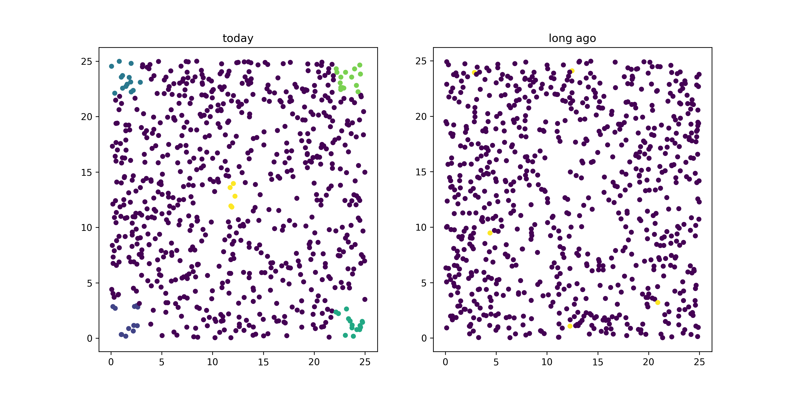
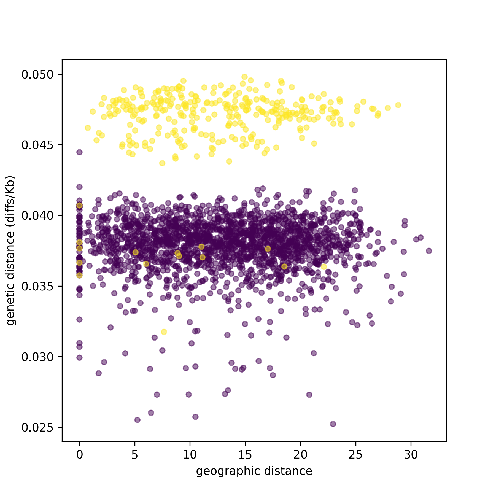

.. _sec_vignette_space:

==============================
Vignette: A spatial simulation
==============================

Here we'll talk through a typical workflow with pyslim,
which will:

1. Simulate data with SLiM, remembering some ancestral individuals.
2. Recapitate and mutate.
3. Take a subsample of the modern and ancestral individuals.
4. Get these individual locations and make a map.
5. Compute divergences between individuals, and plot against geographic distance.
6. Write out a VCF file of these individuals' genotypes and other data for use by other programs.

**********
Simulation
**********

Here is a simple spatial SLiM recipe that simulates 1000 individuals on a spatial landscape.
The focus of this vignette is not on SLiM, so we won't go into detail here.
Here are notes:

1. It does not have *any* mutations: we'll add these on afterwards.
2. There is local fecundity regulation of population density: individuals with more neighbors
   have fewer offspring.
3. We run the simulation for 1000 time steps, and "remember" everyone who is alive at time step 500.

.. code-block:: none

   initialize() {
       setSeed(23);
       initializeSLiMModelType("nonWF");
       initializeSLiMOptions(dimensionality="xy");
       initializeTreeSeq();
       initializeMutationRate(0.0);
       initializeMutationType("m1", 0.5, "f", 0.0);
       initializeGenomicElementType("g1", m1, 1.0);
       initializeGenomicElement(g1, 0, 1e8-1);
       initializeRecombinationRate(1e-8);    

       defineConstant("LAMBDA", 2.0); // birth rate
       defineConstant("K", 1);      // carrying capacity per unit area
       defineConstant("W", 25);      // width and height of the area
       defineConstant("MU", 0.5);     // death rate
       defineConstant("SIGMA", 3.0);  // interaction distance
       
       // spatial interaction for local competition
       initializeInteractionType("i1", "xy", reciprocal=T,
                                 maxDistance = 3 * SIGMA);
       i1.setInteractionFunction("n", 1.0/(2*PI*SIGMA^2), SIGMA);
   }

   reproduction() {
       neighbor_density = i1.totalOfNeighborStrengths(individual);
       num_offspring = rpois(1, LAMBDA / (1 + neighbor_density / K));
       mate = i1.drawByStrength(individual, 1);  // single mating
       if (size(mate) > 0) {
           for (k in seqLen(num_offspring)) {
               offspring = p1.addCrossed(individual, mate);
               pos = individual.spatialPosition + rnorm(2, 0, SIGMA);
               offspring.setSpatialPosition(p1.pointReflected(pos));
           }
       }
   }

   1 early() {
       sim.addSubpop("p1", K * W * W);
       p1.setSpatialBounds(c(0.0, 0.0, W, W));
       for (ind in p1.individuals) {
           ind.setSpatialPosition(p1.pointUniform());
       }
   }

   early() { // survival probabilities
       p1.fitnessScaling = 1 - MU;
   }

   late() {
       i1.evaluate();
   }

   1000 early() {
       sim.treeSeqRememberIndividuals(p1.individuals);
   }

   2000 {
       sim.treeSeqOutput("spatial_sim.trees");
       catn("Done.");
       sim.simulationFinished();
   }

Ok, now let's have a quick look at the output:

.. code-block:: python

   import pyslim, tskit
   import numpy as np

   slim_ts = pyslim.load("spatial_sim.trees")
   print(f"The tree sequence has {slim_ts.num_trees} trees on a genome of length {slim_ts.sequence_length},"
         f" {slim_ts.num_individuals} individuals, {slim_ts.num_samples} 'sample' genomes,"
         f" and {slim_ts.num_mutations} mutations.")

Running this code, we get

.. code-block:: none

   Tree sequence has 43620 trees on a genome of length 100000000.0,
   5287 individuals, 9324 'sample' genomes, and 0 mutations.

It makes sense we have no mutations: we haven't added any yet.
The tree sequence is recording the relationship between 2,410 genomes (the "samples"),
which requires 7,139 distinct trees along the genome.
Individuals are diploid, so why is the number of individuals not equal to twice the number of samples? 
Recall that for the *next* step, recapitation, it is necessary to keep the genomes from the first
generation around in the tree sequence so we can trace back lineages from them.
These extra individuals are from the first generation.
Let's count up when the individuals in the tree sequence were born:

.. code-block:: python

   for t in np.unique(slim_ts.individual_times):
     print(f"There are {np.sum(slim_ts.individual_times == t)} individuals from time {t}.")
   
This gets us

.. code-block:: none

   There are 571 individuals from time 0.0.
   There are 398 individuals from time 1.0.
   There are 320 individuals from time 2.0.
   There are 241 individuals from time 3.0.
   # ... omitting some ...
   There are 1 individuals from time 21.0.
   There are 1 individuals from time 22.0.
   There are 1 individuals from time 24.0.
   There are 1 individuals from time 26.0.
   There are 1 individuals from time 27.0.
   There are 618 individuals from time 1000.0.
   There are 433 individuals from time 1001.0.
   There are 327 individuals from time 1002.0.
   There are 241 individuals from time 1003.0.
   There are 190 individuals from time 1004.0.
   # ... omitting some ...
   There are 1 individuals from time 1022.0.
   There are 1 individuals from time 1024.0.
   There are 1 individuals from time 1027.0.
   There are 625 individuals from time 1999.0.

These "times" record the birth times of each individual.
These are *tskit* times, which are in units of "time ago",
so for instance, there are 398 individuals born one time unit before the end of the simulation
and 320 born two time units before the end of the simulation.
(This confusing choice of units is because tskit was developed for msprime, a coalescent simulator.)
This tells us that 625 of the individuals are those that we initialized the simulation with
(we ran it for 2000 time steps and it began at SLiM time step 1, which is 1999 time steps ago),
and there's some more individuals around 1000 time steps ago, when we asked SLiM to remember
them for us, and some more in the past few time steps, i.e., the present.
This is a non-Wright-Fisher simulation,
and so individuals may live for more than one time step (up to age 27, it seems).
Let's check that all these individuals are alive at either (a) today, (b) 1000 time steps ago,
or (c) the start of the simulation.

.. code-block:: python

   for t in [0, 1000, 1999]:
      alive = slim_ts.individuals_alive_at(t)
      print(f"There were {len(alive)} individuals alive {t} time steps in the past.")

This tells us that

.. code-block:: none

   There were 2309 individuals alive 0 time steps in the past.
   There were 2353 individuals alive 1000 time steps in the past.
   There were 625 individuals alive 1999 time steps in the past.

And, 2309 + 2353 + 625 is 5287, the total number of individuals.
So, this all checks out.

*************************
Recapitation and mutation
*************************

Next, we want to (a) simulate some ancestral diversity and (b) add in neutral mutations.
Please see `Haller et al (2019) <https://onlinelibrary.wiley.com/doi/abs/10.1111/1755-0998.12968>`_
for the why and how of these steps.
But, first let's see if recapitation is necessary:
on how much of the genome is the tree sequence not coalesced?
In other words, recapitation adds diversity present in the initial generation;
will it make a difference? 
In fact, there is *no* segment of the genome that has coalesced;
*every* tree has more than one root:

.. code-block:: none

   >> sum([t.num_roots == 1 for t in slim_ts.trees()])
   0

Next, we will:

1. Recapitate, running a coalescent simulation to build ancestral trees.
2. Mutate, adding neutral variation.
3. Save the resulting tree sequence to disk for future use.

We *won't* simplify at this point, although it would not hurt,
and if we did it would have to come *after* these steps.

.. note::

   The units of time in the tree sequence are SLiM's "time steps", and
   so are not necessarily equal to the mean generation time in a
   non-Wright-Fisher model. Per-generation rates need to be divided by the
   mean generation time, which can be measured in SLiM.

.. code-block:: python

   import msprime

   recap_ts = slim_ts.recapitate(recombination_rate=1e-8, Ne=2000)
   ts = pyslim.SlimTreeSequence(
         msprime.mutate(recap_ts, rate=1e-8, keep=True))
   ts.dump("spatial_sim.recap.trees")

   print(f"The tree sequence now has {ts.num_trees} trees,"
         f" and {ts.num_mutations} mutations.")

This has added mutations according to an infinite-sites model of mutation,
resulting in

.. code-block:: none

   The tree sequence now has 64606 trees, and 204544 mutations.

.. note::

   Since :meth:`mutate <msprime.mutate>` is an msprime method, it does not return a pyslim
   tree sequence, so we need to convert it back, by wrapping the call to `mutate`
   in :func:`.SlimTreeSequence`.

We will have no further use for `slim_ts` or for `recap_ts`;
we've just given them separate names for tidiness.
And, since the original SLiM mutation had no mutations, we didn't need to specify `keep=True`
in :meth:`mutate <msprime.mutate>`, but if we *had* put down selected mutations with SLiM
we'd probably want to keep them around.

****************************
Take a sample of individuals
****************************

Now it's time to compute some things.
In real life we don't get to work with *everyone* usually,
so we'll take a subset of individuals.
The range we have simulated has width and height 20 units,
with a population density of around 1 per unit area.
We'll get genomes to work with by pulling out

1. All the modern individuals in the five squares of width 3 in the corners of the range
   and the center, and
2. Five individuals sampled randomly from everyone alive 500 time steps ago.

.. code-block:: python

   np.random.seed(23)

   alive = ts.individuals_alive_at(0)
   locs = ts.individual_locations[alive, :]

   W = 25
   w = 3
   groups = {
      'topleft' : alive[np.logical_and(locs[:, 0] < w, locs[:, 1] < w)],
      'topright' : alive[np.logical_and(locs[:, 0] < w, locs[:, 1] > W - w)],
      'bottomleft' : alive[np.logical_and(locs[:, 0] > W - w, locs[:, 1] < w)],
      'bottomright' : alive[np.logical_and(locs[:, 0] > W - w, locs[:, 1] > W - w)],
      'center' : alive[np.logical_and(np.abs(locs[:, 0] - W/2) < w/2,
                                      np.abs(locs[:, 1] - W/2) < w/2)]
      }

   old_ones = ts.individuals_alive_at(1000)
   groups['ancient'] = np.random.choice(old_ones, size=5)

   for k in groups:
      print(f"We have {len(groups[k])} individuals in the {k} group.")

.. code-block:: none

   We have 112 individuals in the topleft group.
   We have 72 individuals in the topright group.
   We have 107 individuals in the bottomleft group.
   We have 83 individuals in the bottomright group.
   We have 28 individuals in the center group.
   We have 5 individuals in the ancient group.

To keep names associated with each subset of individuals,
we've kept the individuals in a dict, so that for instance
`groups["topleft"]` is an array of all the individual IDs that are in the top left corner.
The IDs of the ancient individuals we will work with are kept in the array `ancient`.

Let's do a quick sanity check, that everyone in `ancient` was actually born around 500 time steps ago:

.. code-block:: python

   for i in groups["ancient"]:
      ind = ts.individual(i)
      assert(ind.time >= 1000 and ind.time < 1020)

That checks out.

******************
Plotting locations
******************

We should check this: plot where these individuals lie
relative to everyone else.
The individuals locations are available in individual metadata,
but to make things easier, it's also present in a `num_individuals x 3`
numpy array as `ts.individual_locations`.
(There are three columns because SLiM allows for
`(x, y, z)` coordinates, but we'll just use the first two.)
Since `groups["topleft"]` is an array of individual IDs,
we can pull out the locations of the "topleft" individuals
by indexing the rows of the individual location array:

.. code-block:: none

   >>> ts.individual_locations
   array([[21.67473301 23.07757367  0.        ]
          [ 1.55431398  8.33115159  0.        ]
          [ 2.64914304  3.15481677  0.        ]
          ...
          [18.11357265  3.79427758  0.        ]
          [18.71267205  3.99446207  0.        ]
          [ 2.33708453  4.0929182   0.        ]])
   >>> ts.individual_locations.shape
   (5287, 3)
   >>> ts.individual_locations[groups["topleft"], :].shape
   (112, 3)

Using this, we can easily plot the locations of all the individuals from today
(on the left) and 500 time steps ago (on the right).
We have to do a bit of mucking around to set the colors so that they reflect
which group each individual is in.

.. code-block:: python

   import matplotlib
   matplotlib.use('Agg')
   import matplotlib.pyplot as plt

   group_order = ['topleft', 'topright', 'bottomleft', 'bottomright', 'center', 'ancient']
   ind_colors = np.repeat(0, ts.num_individuals)
   for j, k in enumerate(group_order):
      ind_colors[groups[k]] = 1 + j

   old_locs = ts.individual_locations[old_ones, :]

   fig = plt.figure(figsize=(12, 6), dpi=300)
   ax = fig.add_subplot(121)
   ax.set_title("today")
   ax.scatter(locs[:,0], locs[:,1], s=20, c=ind_colors[alive])
   ax = fig.add_subplot(122)
   ax.set_title("long ago")
   ax.scatter(old_locs[:, 0], old_locs[:, 1], s=20, c=ind_colors[old_ones])
   fig.savefig("spatial_sim_locations.png")

*********************
Isolation by distance
*********************

Now, let's look at *isolation by distance*, i.e.,
let's compare geographic and genetic distances.
Here, "genetic distance" will be mean pairwise sequence divergence.
First, we'll compute mean genetic distance between each of our five groups.

The first thing we need to do is some bookkeeping.
So far, we've just worked with *individuals*,
but tree sequence tools, in particular the statistics computation methods from tskit,
are designed to work with *genomes*, also known as "nodes".
So, first we need to pull out the *node IDs* corresponding to the individuals we want.
The things that make up a tree sequence - individuals, nodes, mutations, etcetera -
can generally be examined individually. 
For instance, here's what we have for the five "ancient" individuals:

.. code-block:: none

   >>> for i in ancient:
   ...   print(ts.individual(i))
   ... 
   {'id': 3529, 'flags': 131072, 'location': array([19.39721914,  6.70451961,  0.        ]),
      'metadata': IndividualMetadata(pedigree_id=573541, age=4, population=1, sex=-1, flags=0),
      'nodes': array([2440, 2441], dtype=int32), 'population': 1, 'time': 1004.0}
   {'id': 3676, 'flags': 131072, 'location': array([ 3.23841602, 20.06118178,  0.        ]),
      'metadata': IndividualMetadata(pedigree_id=573976, age=3, population=1, sex=-1, flags=0),
      'nodes': array([2734, 2735], dtype=int32), 'population': 1, 'time': 1003.0}
   {'id': 3998, 'flags': 131072, 'location': array([17.87725144,  3.59648294,  0.        ]),
      'metadata': IndividualMetadata(pedigree_id=574690, age=2, population=1, sex=-1, flags=0),
      'nodes': array([3378, 3379], dtype=int32), 'population': 1, 'time': 1002.0}
   {'id': 4927, 'flags': 131072, 'location': array([ 0.76539931, 19.74287009,  0.        ]),
      'metadata': IndividualMetadata(pedigree_id=575981, age=0, population=1, sex=-1, flags=0),
      'nodes': array([5236, 5237], dtype=int32), 'population': 1, 'time': 1000.0}
   {'id': 4446, 'flags': 131072, 'location': array([20.19949785,  0.51275621,  0.        ]),
      'metadata': IndividualMetadata(pedigree_id=575422, age=1, population=1, sex=-1, flags=0),
      'nodes': array([4274, 4275], dtype=int32), 'population': 1, 'time': 1001.0}

Notice that among other things, each `individual` carries around a list of their `node` IDs,
i.e., their genomes.
We need to put these all in a list of lists,
so that, for instance, the first element of the list will have the node IDs of all the genomes
of the individuals in the "topleft" group.
And, since we kept the individual IDs in a dict, which are unordered,
we'll have to do some extra work to make sure we keep track of order.

.. code-block:: python

   sampled_nodes = [[] for _ in groups]
   for j, k in enumerate(group_order):
      for ind in groups[k]:
         sampled_nodes[j].extend(ts.individual(ind).nodes)

Let's do a sanity check: the number of nodes in each element of this list
should be twice the number of individuals in the corresponding list.

.. code-block:: none

   >>> [len(groups[k]) for k in groups]
   [112, 72, 107, 83, 28, 5]

   >>> [len(u) for u in sampled_nodes]
   [224, 144, 214, 166, 56, 10]
   
So, in the 'topleft' corner there are 51 diploids. That checks out.   

Now, we can compute the matrix of pairwise mean sequence divergences
between and within these sets.
This is done using the :meth:`ts.divergence <tskit.TreeSequence.divergence>` method.

.. code-block:: python

   pairs = [(i, j) for i in range(6) for j in range(6)]
   group_div = ts.divergence(sampled_nodes, indexes=pairs)[0].reshape((6, 6))

   print("\t" + "\t".join(group_order))
   for i, group in enumerate(group_order):
      print(f"{group_order[i]}:\t" + "\t".join(map(str, np.round(group_div[i], 7))))

.. code-block:: none

   group: topleft	topright	bottomleft	bottomright	center	ancient
   topleft:	9.08e-05	9.73e-05	9.7e-05	9.85e-05	9.64e-05	9.85e-05
   topright:	9.73e-05	8.98e-05	9.86e-05	9.81e-05	9.73e-05	9.95e-05
   bottomleft:	9.7e-05	9.86e-05	9.22e-05	9.75e-05	9.73e-05	9.86e-05
   bottomright:	9.85e-05	9.81e-05	9.75e-05	9.15e-05	9.73e-05	9.85e-05
   center:	9.64e-05	9.73e-05	9.73e-05	9.73e-05	9.41e-05	9.9e-05
   ancient:	9.85e-05	9.95e-05	9.86e-05	9.85e-05	9.9e-05	8.59e-05

That's nice, but to look at isolation by distance,
we should actually separate out the individuals.
To do that, we need to create a list of lists of nodes
whose j-th entry is the nodes belonging to the j-th individual,
and to keep track of which group each one belongs to.

.. code-block:: python

   ind_nodes = []
   ind_group = []
   for j, group in enumerate(group_order):
      for ind in groups[group]:
         ind_nodes.append(ts.individual(ind).nodes)
         ind_group.append(group_order[j])

   nind = len(ind_nodes)
   pairs = [(i, j) for i in range(nind) for j in range(nind) if i <= j]
   ind_div = ts.divergence(ind_nodes, indexes=pairs)[0]

Here we've only computed divergences in the *upper triangle* of the pairwise divergence matrix,
with heterozygosities on the diagonal.
We'll also need pairwise geographic distances:

.. code-block:: python

   geog_dist = np.repeat(0.0, len(pairs))
   locs = ts.individual_locations
   for k, (i, j) in enumerate(pairs):
      geog_dist[k] = np.sqrt(np.sum((locs[i, :] - locs[j, :])**2))

Let's check that makes sense: distances of individuals from themselves should be zero.

.. code-block:: python

   for (i, j), x in zip(pairs, geog_dist):
     if i == j:
       assert(x == 0)

Python does not complain, which is good.
Now let's plot genetic distance against geographic distance.

.. code-block:: python

   pair_colors = np.repeat(0, len(pairs))
   for k, (i, j) in enumerate(pairs):
      if ind_group[i] == "ancient" or ind_group[j] == "ancient":
         pair_colors[k] = 1

   fig = plt.figure(figsize=(6, 6), dpi=300)
   ax = fig.add_subplot(111)
   ax.scatter(geog_dist, 1e3 * ind_div, s=20, alpha=0.5,
              c=pair_colors)
   ax.set_xlabel("geographic distance")
   ax.set_ylabel("genetic distance (diffs/Kb)")
   fig.savefig("spatial_sim_ibd.png")

Since we multiplied `ind_div` by 1,000,
the units of genetic distance are in mean number of nucleotide differences per kilobase.
There is *not* strong IBD in this noisy and relatively small simulation,
but notice that the "ancient" samples are more deeply diverged from modern samples (in yellow)
than most modern ones are from each other.

**********
VCF output
**********

Now we want to write out these data for analysis with other programs.
To do this, and make sure that everything stays nicely cross-referenced,
we're going to loop through the sampled individuals, writing their information to a file,
while at the same time constructing a list of individual IDs,
whose genomes we will write out to a VCF file.

.. code-block:: python

   indivlist = []
   indivnames = []
   with open("spatial_sim_individuals.txt", "w") as indfile:
     indfile.writelines("\t".join(["vcf_label", "tskit_id", "slim_id"]
                                  + ["birth_time_ago", "age", "x", "y"]) + "\n")
     for group in group_order:
        for i in groups[group]:
           indivlist.append(i)
           ind = ts.individual(i)
           vcf_label = f"tsk_{ind.id}"
           indivnames.append(vcf_label)
           data = [vcf_label, str(ind.id), str(ind.metadata.pedigree_id), str(ind.time),
                   str(ind.metadata.age), str(ind.location[0]), str(ind.location[1])]
           indfile.writelines("\t".join(data) + "\n")

   with open("spatial_sim_genotypes.vcf", "w") as vcffile:
     ts.write_vcf(vcffile, individuals=indivlist, individual_names=indivnames)

****************
More information
****************

1. The distinction between "nodes" (i.e., genomes) and "individuals" can be confusing,
   as well as the idea of "samples".
   Please see the
   `tskit documentation <https://tskit.readthedocs.io/en/latest/data-model.html>`_
   for more explanation about these concepts.

2. The general interface for computing statistics (explaining, for instance, the "indexes"
   argument above) is described in
   `the tskit documentation <https://tskit.readthedocs.io/en/latest/stats.html>`_
   also.

**************************
What about simplification?
**************************

The tree sequence we worked with here contains more information than we need,
including the first generation individuals.
If we wanted to remove this, we could have used the
:meth:`simplify <tskit.TreeSequence.simplify>` method,
which reduced the tree sequence to the minimal required to record the information
about a provided set of nodes.
In the workflow above we didn't ever *simplify* the tree sequence,
because we didn't need to.
Because simplify reorders nodes and removes unused individuals and populations,
it requires an extra layer of bookkeeping.
Such relabeling also makes it harder to compare results across different analyses
of the same data.

Simplifying the tree sequence down to the nodes of the individuals
in our "groups" would not change any subsequent analysis (except perhaps
removing monomorphic sites in the VCF output),
and would speed up computation of diversity.
Since the calculation was fast already, it wasn't worth it in this case,
but for much larger tree sequences it could be worth the extra code complexity.

